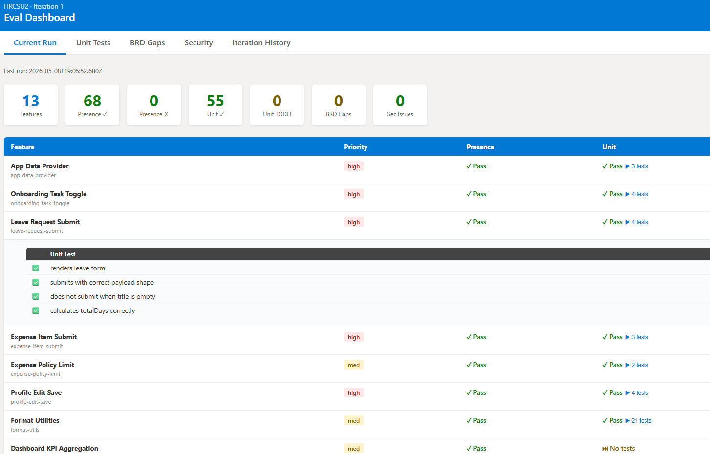
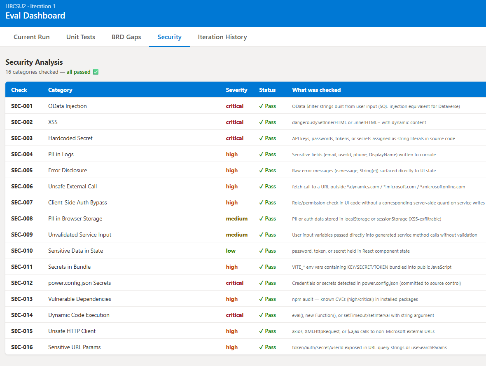

# Power CAT Pro-Code Eval Plugin

This plugin provides automated eval generation for Power Apps Code Apps and Generative Pages — two of the modern pro-code development surfaces on Microsoft Power Platform. In a single command it reads your source code, maps what is built against what was planned, runs unit tests in a sandboxed environment, and performs a static security scan. Results are surfaced through a self-contained HTML dashboard.





> **Preview:** This plugin is currently in [preview](https://www.microsoft.com/en-us/business-applications/legal/supp-powerplatform-preview/). These features are available before official release for customers to provide feedback.

## Prerequisites

- A Power Apps **Code App** project (created with `npx power-apps init`) **or** a Power Apps **Generative Page** (single-file React/TypeScript component using `dataApi`)
- Node.js 18 or later
- `npm` available in your terminal

## Installation

### From the marketplace

```
/plugin marketplace add microsoft/power-cat-skills
/plugin install powercat-procode-eval@power-cat-skills
```

### From a local clone

```
claude --plugin-dir /path/to/power-cat-skills/plugins/powercat-procode-eval
```

## Skills

### `/eval-generator-code-app`

Generates a two-layer eval suite — feature presence checks and static security analysis — for a **Power Apps Code App**.

USE WHEN the user wants to check feature completeness, generate security findings, validate that a Code App implements its requirements, generate test scaffolding, or review a Code App against a business requirements document.

**DO NOT USE** for PCF components or Generative Pages — use `/eval-generator-gen-pages` for those.

**Usage:** Invoke directly with `/eval-generator-code-app`, or use any of the keywords below to trigger the skill automatically:

- `Generate code app evals`
- `Eval my code app`
- `Generate tests for code app`
- `Code app eval generator`
- `Check feature completeness code app`

---

### `/eval-generator-gen-pages`

Generates a three-layer eval suite — feature presence checks, Vitest unit tests, and static security analysis — for a **Power Apps Generative Page** in a Model-Driven App.

USE WHEN the user wants to check feature completeness, run unit tests against a Generative Page component, generate security findings, validate against a BRD, or review code quality for a Model-Driven App page built with the App Agent or AI tools.

**DO NOT USE** for Code Apps — use `/eval-generator-code-app` for those.

**Usage:** Invoke directly with `/eval-generator-gen-pages`, or use any of the keywords below to trigger the skill automatically:

- `Eval my generative page`
- `Generate evals for gen page`
- `Review my genpage code`
- `Test my generative page`
- `Check my model driven app page`

---

## Running the Evals

After either skill completes, run from your project root:

```bash
npm run eval           # all layers + update dashboard
npm run eval:presence  # feature presence checks only
npm run eval:unit      # unit tests only (gen-pages skill)
npm run eval:security  # security scan only
```

Open `evals/dashboard/index.html` in a browser to see the full report.

## What These Skills Check

**Feature Presence** — verifies that the code structure implementing each feature actually exists: connector imports, service calls, error handling, loading states, and SDK initialisation. Returns pass or fail per feature.

**Unit Tests** (gen-pages only) — runs automated tests for component behaviour using mocked `dataApi` calls in a jsdom sandbox. Tests cover loading states, data rendering, empty states, error states, and correct query parameters.

**Security Scan** — runs 14-16 static checks across all source files for known risk patterns: hardcoded secrets, XSS, OData injection, PII in logs, unsafe external HTTP calls, sensitive data in storage, dynamic code execution, and more. Each finding includes the exact file, line number, and remediation guidance.

## What These Skills Do NOT Cover

| Not covered | Why |
|---|---|
| Runtime behaviour with real data | Skills never connect to Dataverse or live connectors |
| Dynamic data validation | All checks are static — live API values are not tested |
| UI visual correctness | No browser rendering or visual regression testing |
| End-to-end user flows | Multi-screen navigation and form submission are not tested |
| Performance | Response times and query efficiency are not measured |
| Power Platform deployment | pac solution push success is not checked |
| Accessibility | WCAG compliance and keyboard navigation are not evaluated |
| PCF components | These skills are for Code Apps and Generative Pages only |

## Security

These skills perform **read-only static analysis** of your source code. They never connect to your Dataverse environment, transmit your source code to any external endpoint, or store credentials or tokens. All analysis runs locally on your machine.

MCP is a new and developing standard. As with all new technology standards, you should review the security of any systems that integrate with MCP servers, such as MCP hosts, clients, agents, AI applications, and models and confirm that they comply with system requirements, standards, and expectations. You should follow Microsoft security guidance for MCP servers, including enabling Entra ID authentication, secure token management, and network isolation. Refer to [Microsoft Security Documentation](https://learn.microsoft.com/en-us/security/) for details.

## Support

If you face issues with:

- **Using the Power CAT Plugin:** Report your issue here: https://github.com/microsoft/power-cat-skills/issues (Microsoft Support won't help you with issues related to this Plugin, but they will help with related, underlying platform and feature issues.)
- **Power Apps Code Apps or Generative Pages:** Use your standard channel to contact Microsoft Support.

## License

See the [LICENSE](../../LICENSE) file for license information.
